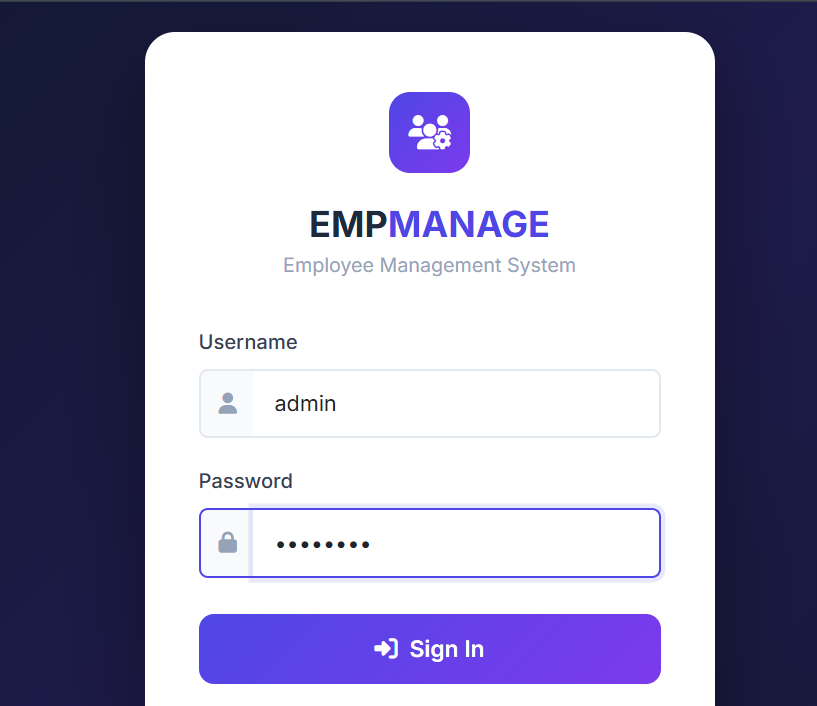
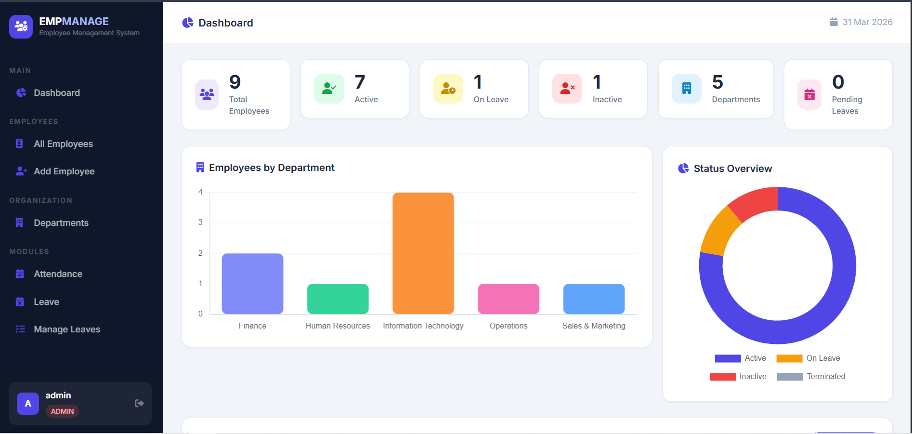
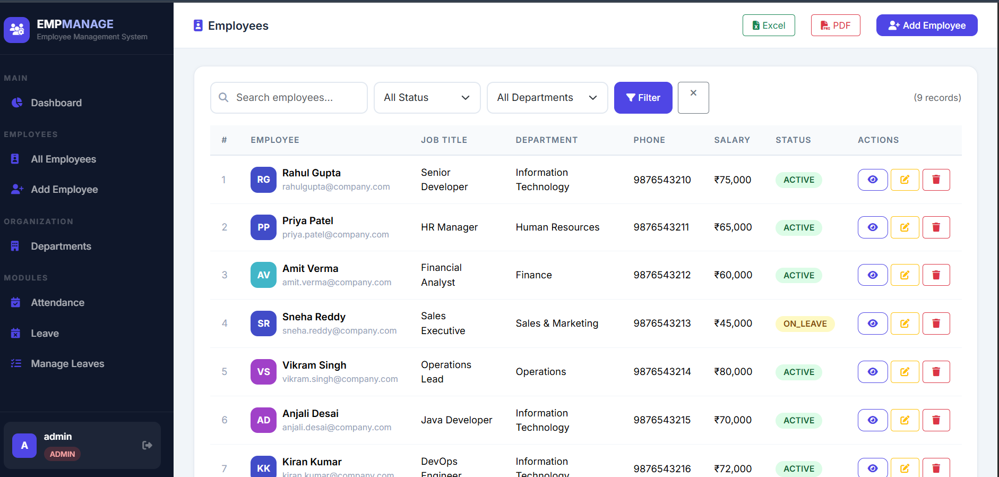
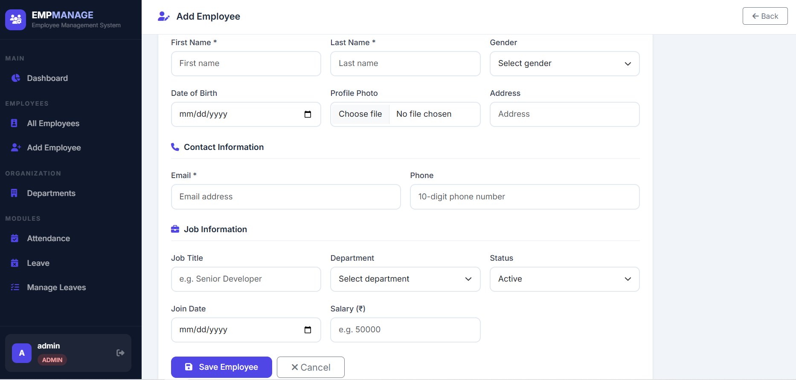
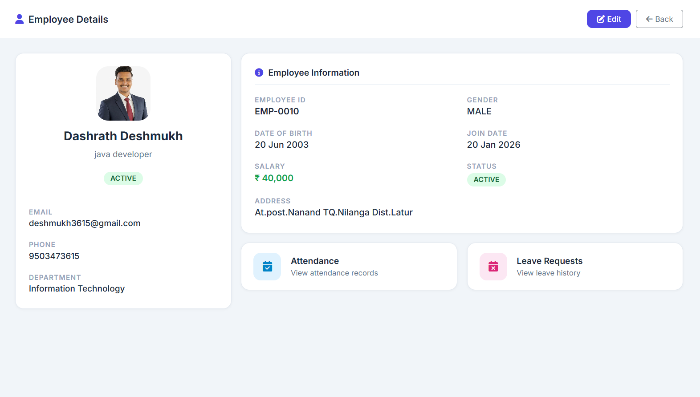
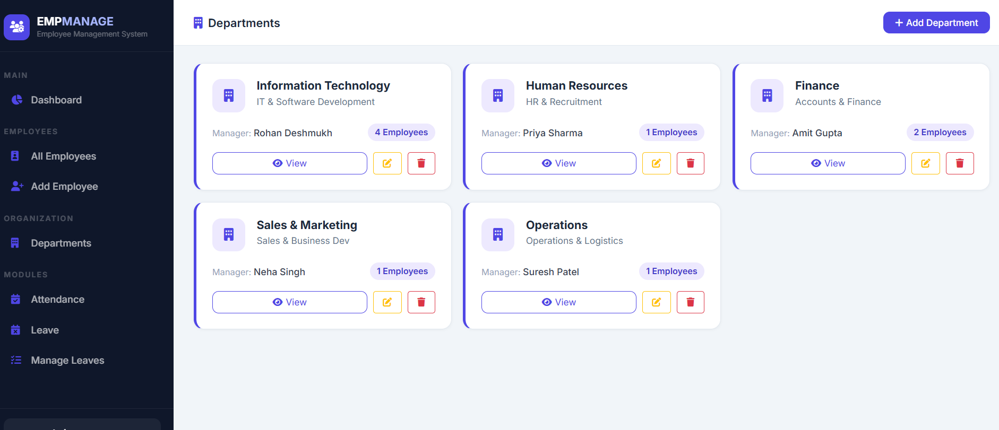
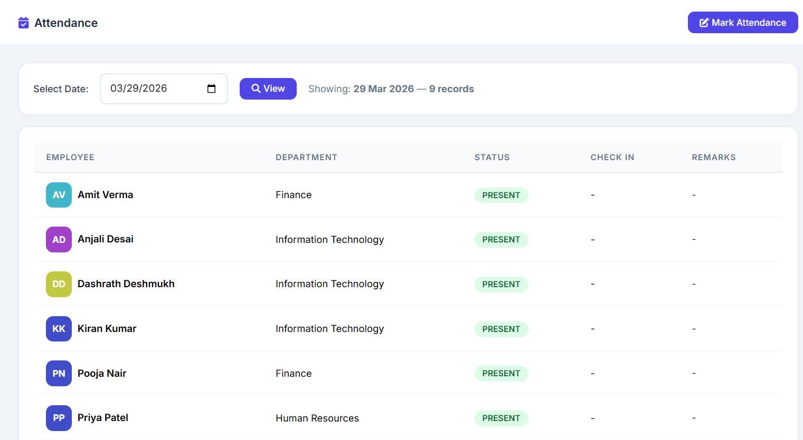
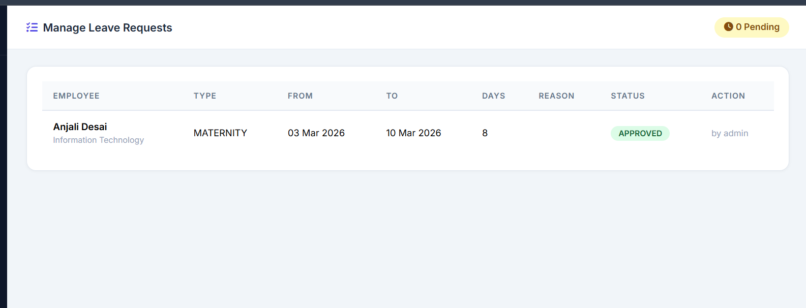

<div align="center">

# 👥 Employee Management System

### A full-stack web application built with Spring Boot for managing employees, departments, attendance, and leaves efficiently.


[Features](#-features) • [Tech Stack](#-tech-stack) • [Getting Started](#-getting-started) • [Roles](#-role-based-access) • [Screenshots](#-screenshots) • [Project Structure](#project-structure)

</div>

---

## 📌 About The Project

The **Employee Management System (EMS)** is a secure, responsive, full-featured web application that allows organizations to manage their entire workforce from a single centralized dashboard.

Built with **Spring Boot 3.2 MVC** architecture, **Thymeleaf** templates, **Spring Security 6** with role-based access control, and a modern **Bootstrap 5** UI — it supports complete employee lifecycle management including attendance tracking and leave workflows.

---

## ✨ Features

- 🔐 **Role-Based Access Control** — ADMIN, HR, and EMPLOYEE roles with separate permissions
- 📊 **Live Dashboard with Charts** — Bar chart (dept-wise) + Doughnut chart (status overview) using Chart.js
- 👤 **Employee CRUD** — Add, Edit, View, Delete with profile photo upload
- 🏢 **Department Management** — Full department lifecycle with employee count
- 🔍 **Search & Filter** — Search by name/email/title + filter by status and department
- 📅 **Attendance Module** — Daily attendance marking with check-in time, bulk "All Present" feature
- 🌿 **Leave Management** — Apply, approve/reject workflow with comments
- 📤 **Export Excel & PDF** — Download employee list in Excel (Apache POI) or PDF (iTextPDF)
- 🖼️ **Profile Photo Upload** — Upload and display employee photos
- 🎨 **Professional UI** — Dark sidebar, Inter font, clean card layout
- 📱 **Responsive Design** — Works on desktop, tablet, and mobile
- 🌱 **Auto Seed Data** — 8 sample employees + 5 departments loaded on first run

---

## 🛠 Tech Stack

| Layer | Technology |
|-------|------------|
| Backend | Spring Boot 3.2, Spring MVC |
| Security | Spring Security 6, BCrypt |
| ORM | Spring Data JPA, Hibernate |
| Frontend | Thymeleaf, Bootstrap 5.3, Chart.js 4, FontAwesome 6 |
| Database | MySQL 8.0 |
| Export | Apache POI 5.2.3 (Excel), iTextPDF 5.5.13 (PDF) |
| Build Tool | Maven 3.6+ |
| Server | Embedded Apache Tomcat 10 |
| Language | Java 17 |

---

## 🚀 Getting Started

### Prerequisites

- ☕ [JDK 17+](https://adoptium.net/)
- 🛠 [Maven 3.6+](https://maven.apache.org/)
- 💻 [Eclipse IDE](https://www.eclipse.org/downloads/) or IntelliJ IDEA
- 🗄 [MySQL 8.0+](https://www.mysql.com/)

---

### 🗄 Database Setup

```sql
CREATE DATABASE employee_db;
```

---

### ⚙️ Configure application.properties

Open `src/main/resources/application.properties` and update your MySQL password:

```properties
spring.datasource.url=jdbc:mysql://localhost:3306/employee_db?useSSL=false&serverTimezone=UTC&allowPublicKeyRetrieval=true
spring.datasource.username=root
spring.datasource.password=YOUR_PASSWORD
```

---

### ▶️ Run the Application

**Option 1 — Eclipse:**
```
1. File → Import → Maven → Existing Maven Projects
2. Browse → Select project folder → Finish
3. Wait for Maven to download dependencies
4. Right-click EmployeeManagementApplication.java
5. Run As → Spring Boot App
```

**Option 2 — Terminal:**
```bash
git clone https://github.com/Dashrath9503/employee-management-system.git
cd employee-management-system
mvn spring-boot:run
```

Open browser → **http://localhost:8080**

---

## 🔑 Default Credentials

| Username | Password | Role |
|----------|----------|------|
| admin | admin123 | ADMIN |
| hr | hr123 | HR |
| emp | emp123 | EMPLOYEE |

> ⚠️ Change default passwords before deploying to production.

---

## 👮 Role-Based Access

| Feature | ADMIN | HR | EMPLOYEE |
|---------|-------|----|----------|
| Dashboard + Charts | ✅ | ✅ | ✅ |
| View Employees | ✅ | ✅ | ✅ |
| Add / Edit Employee | ✅ | ✅ | ❌ |
| Delete Employee | ✅ | ❌ | ❌ |
| Profile Photo Upload | ✅ | ✅ | ❌ |
| View Departments | ✅ | ✅ | ✅ |
| Add / Edit Department | ✅ | ✅ | ❌ |
| Delete Department | ✅ | ❌ | ❌ |
| Apply Leave | ✅ | ✅ | ✅ |
| Approve / Reject Leave | ✅ | ✅ | ❌ |
| View Attendance | ✅ | ✅ | ✅ |
| Mark Attendance | ✅ | ✅ | ❌ |
| Export Excel / PDF | ✅ | ❌ | ❌ |

---

## 📸 Screenshots

### 🔐 Login Page


### 📊 Dashboard with Charts


### 👥 Employee List


### ➕ Add Employee


### 👤 Employee Details


### 🏢 Departments


### 📅 Attendance


### 🌿 Leave Management


```

## 📁 Project Structure


employee-management/
├── src/
│   └── main/
│       ├── java/com/emp/management/
│       │   ├── config/
│       │   │   ├── SecurityConfig.java        # Spring Security + Role config
│       │   │   ├── DataInitializer.java       # Sample data seeder
│       │   │   └── WebMvcConfig.java          # Static resource handler
│       │   ├── controller/
│       │   │   ├── DashboardController.java
│       │   │   ├── EmployeeController.java    # CRUD + Export
│       │   │   ├── DepartmentController.java
│       │   │   ├── LeaveController.java       # Leave workflow
│       │   │   └── AttendanceController.java  # Attendance marking
│       │   ├── model/
│       │   │   ├── Employee.java
│       │   │   ├── Department.java
│       │   │   ├── User.java
│       │   │   ├── LeaveRequest.java
│       │   │   └── Attendance.java
│       │   ├── repository/
│       │   │   ├── EmployeeRepository.java
│       │   │   ├── DepartmentRepository.java
│       │   │   ├── UserRepository.java
│       │   │   ├── LeaveRequestRepository.java
│       │   │   └── AttendanceRepository.java
│       │   └── service/
│       │       ├── EmployeeService.java
│       │       ├── DepartmentService.java
│       │       ├── LeaveService.java
│       │       ├── AttendanceService.java
│       │       ├── ExportService.java         # Excel + PDF export
│       │       └── CustomUserDetailsService.java
│       └── resources/
│           ├── templates/
│           │   ├── dashboard.html
│           │   ├── login.html
│           │   ├── access-denied.html
│           │   ├── fragments/layout.html      # Shared sidebar
│           │   ├── employee/
│           │   │   ├── list.html
│           │   │   ├── form.html
│           │   │   └── view.html
│           │   ├── department/
│           │   │   ├── list.html
│           │   │   ├── form.html
│           │   │   └── view.html
│           │   ├── leave/
│           │   │   ├── list.html
│           │   │   ├── form.html
│           │   │   ├── all.html
│           │   │   └── review.html
│           │   └── attendance/
│           │       ├── list.html
│           │       ├── mark.html
│           │       └── employee.html
│           └── application.properties
└── pom.xml
```

---

## 🗃 Database Schema

```sql
CREATE TABLE users (
    id          BIGINT AUTO_INCREMENT PRIMARY KEY,
    username    VARCHAR(50)  NOT NULL UNIQUE,
    password    VARCHAR(255) NOT NULL,
    role        VARCHAR(20)  NOT NULL,
    full_name   VARCHAR(100),
    employee_id BIGINT,
    enabled     BOOLEAN DEFAULT TRUE
);

CREATE TABLE departments (
    id           BIGINT AUTO_INCREMENT PRIMARY KEY,
    name         VARCHAR(100) NOT NULL UNIQUE,
    description  VARCHAR(500),
    manager_name VARCHAR(100)
);

CREATE TABLE employees (
    id             BIGINT AUTO_INCREMENT PRIMARY KEY,
    first_name     VARCHAR(50)  NOT NULL,
    last_name      VARCHAR(50)  NOT NULL,
    email          VARCHAR(100) NOT NULL UNIQUE,
    phone          VARCHAR(15),
    job_title      VARCHAR(100),
    gender         ENUM('MALE','FEMALE','OTHER'),
    date_of_birth  DATE,
    join_date      DATE,
    salary         DOUBLE,
    status         ENUM('ACTIVE','INACTIVE','ON_LEAVE','TERMINATED') DEFAULT 'ACTIVE',
    address        VARCHAR(500),
    profile_image  VARCHAR(255),
    department_id  BIGINT,
    FOREIGN KEY (department_id) REFERENCES departments(id)
);

CREATE TABLE leave_requests (
    id             BIGINT AUTO_INCREMENT PRIMARY KEY,
    employee_id    BIGINT NOT NULL,
    leave_type     ENUM('SICK','CASUAL','ANNUAL','MATERNITY','PATERNITY','UNPAID'),
    start_date     DATE,
    end_date       DATE,
    reason         VARCHAR(500),
    status         ENUM('PENDING','APPROVED','REJECTED') DEFAULT 'PENDING',
    applied_on     DATETIME,
    reviewed_by    VARCHAR(100),
    review_comment VARCHAR(500),
    FOREIGN KEY (employee_id) REFERENCES employees(id)
);

CREATE TABLE attendance (
    id               BIGINT AUTO_INCREMENT PRIMARY KEY,
    employee_id      BIGINT NOT NULL,
    attendance_date  DATE NOT NULL,
    status           ENUM('PRESENT','ABSENT','HALF_DAY','LATE','ON_LEAVE'),
    check_in         TIME,
    check_out        TIME,
    remarks          VARCHAR(300),
    FOREIGN KEY (employee_id) REFERENCES employees(id)
);
```

---

## 🔮 Future Enhancements

- [ ] Payroll / Salary slip generation
- [ ] Email notifications on leave status change
- [ ] Employee self-service portal
- [ ] REST API for mobile integration
- [ ] Dark mode toggle
- [ ] Pagination on employee list
- [ ] Audit log (track who changed what)

---

## 📜 License

This project is licensed under the **MIT License** — see the [LICENSE](LICENSE) file for details.

---

## 🙋‍♂️ Author

**Dashrath Deshmukh**
- GitHub: [@Dashrath9503](https://github.com/Dashrath9503)
- LinkedIn: [Dashrath Deshmukh](https://linkedin.com/in/dashrath-deshmukh-9a732b368/)

---

<div align="center">
⭐ If you found this project helpful, please give it a star!
</div>
